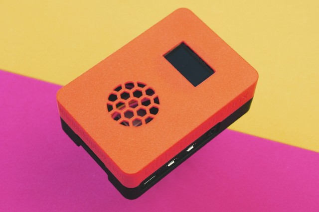
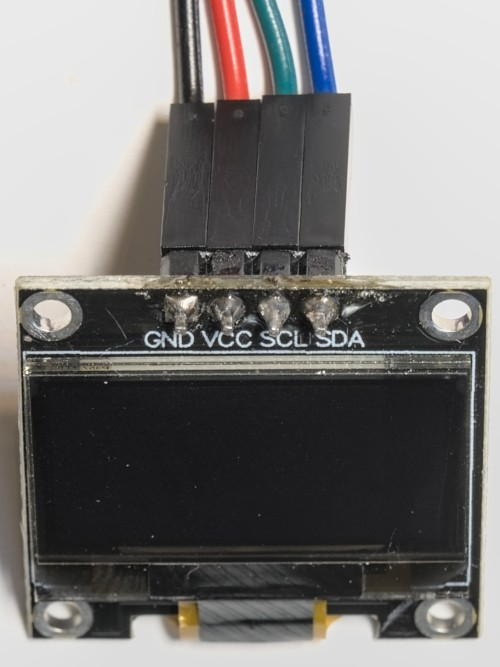

# Display
Little Backup Box uses [luma.oled](https://github.com/rm-hull/luma.oled) as the display driver. In principle, all displays supported by luma.oled can be controlled. 
 
Some displays do not seem to be suitable for the Little Backup Box due to the resolution or geometry, so they are currently not supported. For others, there may be undesirable representations. Feedback is requested here, optimizations may be possible. 
 
**A Display must be configured <u>and</u> activated in the settings.** 
## Tested displays
| Display | Experience |
|---------|------------|
|I2C/SPI ssd1306 monochrome 128x64 pixels |Working, no problems known.|
|I2C/SPI ssd1306 dual color 128x64 pixels |Working but not recommended. The display works like a monochrome display, but a part in the upper area is shown in its own color. This does not correspond to lbb's display usage.|
|SPI ssd1331 color display|Working, no problems known. Colors are supported. Because the display is smaller (96x64 pixels vs. the 128x64 pixels of ssd1306), please select font size 10. Other settings: RGB, SPI|

 
*Image 1: Case with display* 
Little Backup Box supports a 128x64 dot display. This must be addressable with I2C or SPI. These devices usually will cost less than 10 €.
In addition, you need jumper cables in a female-female configuration.
## I2C
Your display has 4 PINS:

* GND: Ground, black in Image 2
* VCC: Power 3.3V or 5.0V, depends on your display, red in Image 2
* SCL: i2c-clock, green in Image 2
* SDA: i2c-data, blue in Image 2

 
*Image 2* 

At first find out the specifications of your display: VCC 3.3V or 5.0V? Your vendor should provide the information.

* unplug your Raspberry Pi
* connect Display-VCC to PIN 1 "3V3 power" or PIN 2 "5V power", depending on your displays specifications.
* connect Display-SCL to PIN 5 "GPIO 3 (SCL)"
* connect Display-SDA to PIN 3 "GPIO 2 (SDA)"
* connect Display-GND to PIN 6 "Ground" (or any other of the PINs named "Ground")

 
*Image 3: From [https://www.raspberrypi.com/documentation/computers/os.html](https://www.raspberrypi.com/documentation/computers/os.html) under a [Creative Commons Attribution-ShareAlike 4.0 International](https://creativecommons.org/licenses/by-sa/4.0/) (CC BY-SA) licence.* 

No liability is assumed for any damage caused by errors (including grossly negligent) in these instructions.

## SPI
SPI has up to seven pins:

* VCC: Power 3.3V
* GND: Ground
* D0: Clock
* D1: MOSI
* RST: Reset
* DC: Data/Command
* CS: Chip Select

If available:
* BL: Backlight

Please also note Figure 3 for wiring.

* unplug your Raspberry Pi
* connect Display-VCC to PIN 1 "3V3 power"
* connect Display-GND to PIN 6 "Ground" (or any other of the PINs named "Ground")
* connect Display-D0 Clock to PIN 23 GPIO 11 (SCLK)
* connect Display-D1 MOSI to PIN 19 GPIO 10 (MOSI)
* connect Display-Reset to PIN 22 GPIO 25
* connect Display-DC to PIN 18 GPIO 24
* connect Display-CS to PIN 24 GPIO 8 (CE0)

If available:
* connect Backlight-BL to PIN 16 GPIO 23
No liability is assumed for any damage caused by errors (including grossly negligent) in these instructions.

## Display functions
The display shows the current status. Depending on the situation, it shows which user action is expected (e.g. that a device is to be connected) or what the progress of the current process is.

If the status bar is activated, the bottom line shows the
* connection status of Comitup
and toggles between
* CPU load & CPU temperature and
* Network traffic
