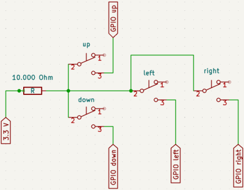

# Buttons

This function is pretty new and not yet fully tested. Please give feedback about you experiance and about any errors!

## Why?
Essential functions of the Little Backup Box can also be controlled via buttons and display. After pressing a key, a menu is displayed. You can navigate through this with the help of the keys. Thus, among other things, the different backup types can be started.

## What do I need?
The first requirement is a display. The installation is dealt with in Wiki under 02. Hardware. 
In addition to the four buttons themselves, a resistor of approx. 10,000 ohms is required. The resistor connects a 3.3 volt pin to the four buttons. The respective free contact (active=on) of the button is connected to the pins:

* 29 (GPIO 5): Up
* 31 (GPIO 6): Down
* 11 (GPIO 17): Left
* 13 (GPIO 27): Right

That's the whole installation.

 

 
*Image 3: From [https://www.raspberrypi.com/documentation/computers/os.html](https://www.raspberrypi.com/documentation/computers/os.html) under a [Creative Commons Attribution-ShareAlike 4.0 International](https://creativecommons.org/licenses/by-sa/4.0/) (CC BY-SA) licence.* 

No liability is assumed for any damage caused by errors (including grossly negligent) in these instructions.
