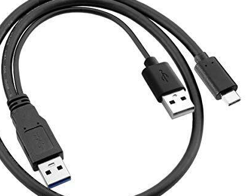

# Power supply

## Raspberry Pi 5
The Raspberry Pi 5 has a significantly improved power supply for the USB ports. The original 27 W power supply can also be used to power energy-intensive USB devices.
However, this power supply has disadvantages when traveling. It is relatively large and heavy. In addition, the USB cable is firmly connected. This makes it bulky and also prone to damage when traveling. The solution here can be a dual power cable. The little backup box can be operated very reliably with two power supplies or just two outputs from a power supply or a power bank. 

Tests with your own equipment are of course essential in any case. 
 
## General
The supply to the USB ports is very weak in all models before the Raspberry Pi 5. Unfortunately, with many connected devices (smartphones, card readers, SSD drives, etc.), significant disruptions are to be expected if you have to rely on the Pi for power supply. A powered USB hub is therefore strongly recommended here.
