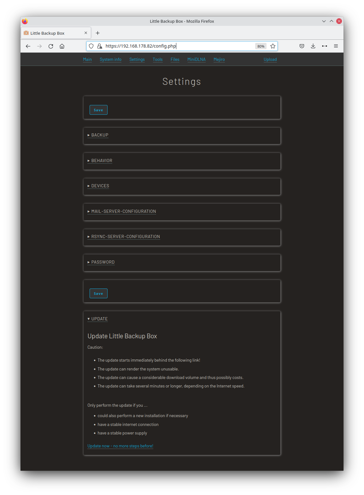
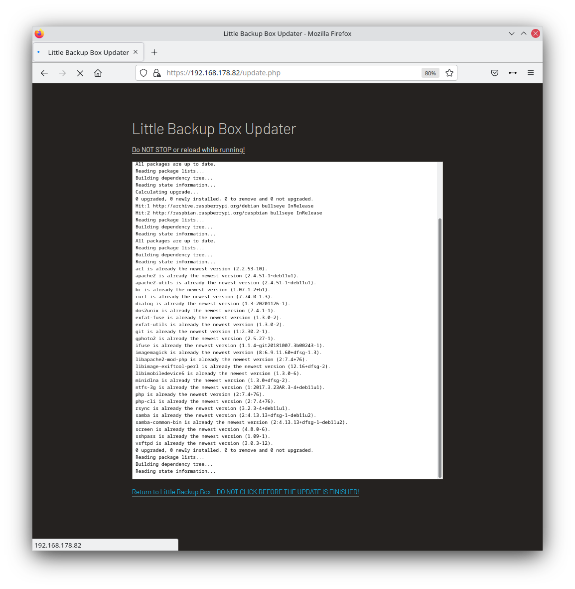

# Installation
## Installation
Follow the instructions at [https://github.com/outdoorbits/little-backup-box](https://github.com/outdoorbits/little-backup-box) 

## Update
To update you can use the web-based updater:
1. Point your browser to your Little Backup Box webUI
2. Navigate to "Settings"
3. Scroll down and open the "Update"-section
4. Follow the instructions

