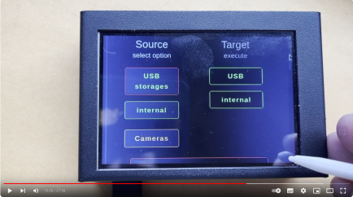

# Installation on a touchscreen system
## Installation
It should be noted that for a touchscreen system, it is not Raspberry Pi OS lite that needs to be installed, but rather the **full version**. 
In addition, before little-backup-box is installed, any display drivers that may be required should be installed so that the screen already works before little-backup-box is installed. 
The rest of the installation is the same as the headless installation: 

Follow the instructions at [https://github.com/outdoorbits/little-backup-box](https://github.com/outdoorbits/little-backup-box) 
and the wiki page [Installation](03.-Installation.md).

After installation, the Raspberry Pi will reboot and the user interface should appear on the display.

<a href="https://youtu.be/qAEebY8UlRc">
 
Little Backup Box in a touchscreen housing - watch Dave's video on YouTube</a>
 
